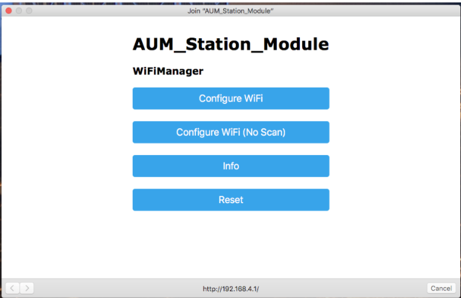
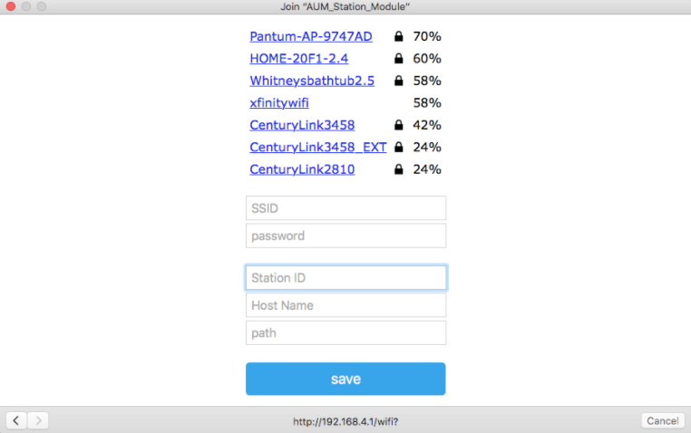
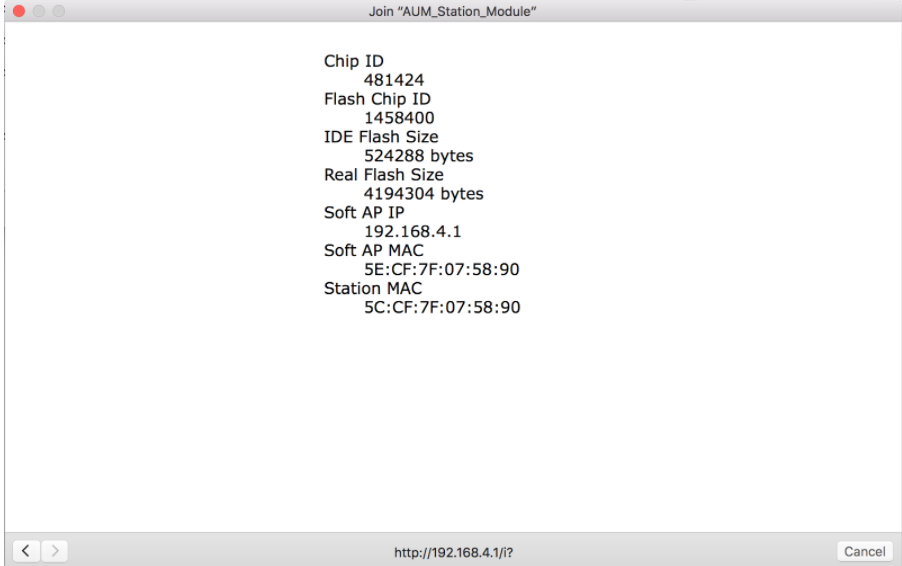

### How to connect the module to the Wifi
The Station Module will automatically try to connect to the last known good Wifi. If it cannot connect, it will restart itself and set up an Access Point called **AUM_Station_Module**. 
The AP has a captive portal, so anytime you connect, you will be redirected to the config page. This mode can also be accessed at any time by holding down the “logout” button for a few seconds while cycling power or doing a reset.
 
**Captive Portal Page:**

- select “Configure WiFi”
 
 
 
**Configuration Page:**

- Click the AP you want to connect to.
- Fill in password
- Fill in station module ID
- Fill in host name. Ex:  aummanage.com
- Fill in path. Ex:   \aum
- click save and the unit will restart
 
---
The Wifi and password credentials will persist after a hard reset, however, the function to save the host and custom path in EEPROM was not implemented due to complications getting it to work.  They will revert to the default values if power is cycled.
---
 
**Important:** For the host and path: Don't use http:// for the host, just "host.com" or whatever.  For the path, the first character should be a slash, with no trailing slash.
 
 
 
 
 
If the network you are trying to connect to requires a username and a password, then you must contact the network administrator and register the station module’s MAC address. Usernames and passwords are not supported on this device.
You will need the MAC address:  
In the captive portal, Click on info:  the Station MAC is listed.

**Info Page** 

 
 
  **For PSU:**   Browse to:    [https://intranet.pdx.edu/oit/internet-device-registration](https://intranet.pdx.edu/oit/internet-device-registration)  and fill out a  Internet Device Registration request.
